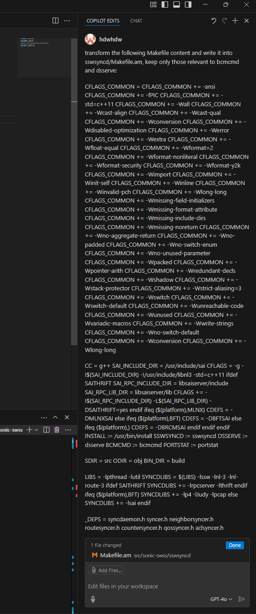

# Lightning Talk: Dawei Huang

## Ask Me About
- Work related:
    - gNOI (gRPC Network Operations Interface)
    - High-Performance C++.
    - Code health: https://abseil.io/tips/
    - Host Networking
    - Microsecond level performance
- Non-work related:
    - Arsenal FC
    - Food
    - Gardening

## GNOI (gRPC Network Operations Interface)
- Overview of GNOI
  - https://github.com/openconfig/gnoi/
  - gNOI is a gRPC-based interface for network operations.
  - Examples:
    - gNOI System Reboot
    - gNOI OS Verify
    - gNOI Containerz StopContainer
- Why gNOI?
    - API vs CLI:
        - API: More structured, easier to automate, and can be used across different platforms.
        - CLI: Less structured, harder to automate, and often platform-specific.
    - gNOI provides a standardized way to perform network operations across different devices.
- Our Progress:
    - Some supports for gNOI in SONiC.
      - Focus on System Reboot and Upgrade:
        - gNOI System Reboot:
        - gNOI System SetPackage:
      - Some other utilities:
        - gNOI File Stats
        - gNOI System KillProcess.
    - No Production Users Yet.
    - Goal:
        - Replace HardwareProxy.
        - More tests written in gNOI (instead of `dut.shell()`)

## AI in Development Workflow
- My AI usecase:
    - Note taking:
        - VSCode + GitHuB Copilot.
    - Code review:
        - ChatGPT.
    - Code generation:
        - GithuB Copilot (inline).
        - ChatGPT (planning).
- Example:
    - [Client side code for GNOI.System.SetPackage](https://github.com/sonic-net/sonic-gnmi/pull/358/files)
        - ChatGPT + Copy + Paste.
    - [Open source bcmcmd and dsserve](https://github.com/sonic-net/sonic-swss/pull/3564)
        - 
        - Copilot.

- Lessons learned:
    - My Journey:
        - ChatGPT + Copy + Paste:
            - Rely on training (ChatGPT being smart and can guess your context).
        - VSCode + Copilot:
            - Explicit context management.
            - 
        - Tried other tools:
            - Warp terminal: https://warp.dev/
            - Aider: https://aider.chat/
            - VSCode + Copilot FTW.
    - Understand how AI works:
        - The concept of "context window".
    - It definitely takes more than one try.
        - AI code -> run -> paste error message -> AI fix -> run -> ...
        - Prompt AI to not repeat the same mistake.
    - It helps to start from easy and make small incremental changes::
        - What's the easiest task you can make AI do that leads to your eventual goal?
        - Example:
            - "Write a placeholder function that does nothing."
            - "Modify the function to do X."
            - "Add error handling for Y."
            - "Logging is insufficient, add more logging."

- Explorations:
    - `Cursor` (`@codebase` integration)
    - `Warp` for running commands:
        - auto fixes when commands fails.