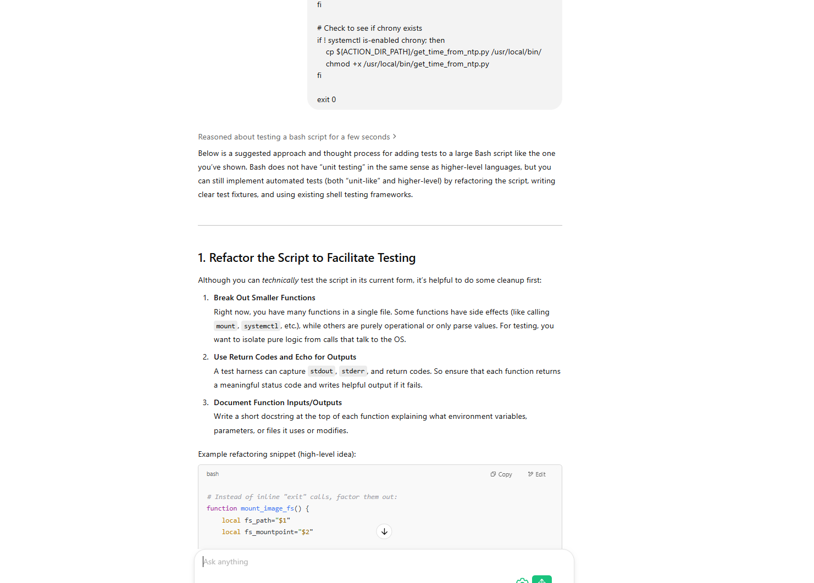

# ⚡️ Lightning Talk: Dawei Huang

## 💬 Ask Me About

### 🛠️ **Work-Related**
- **gNOI** *(gRPC Network Operations Interface)*
- **High-Performance C++**
- [**Code Health**](https://abseil.io/tips/)
- **Host Networking**
- **Microsecond-Level Performance**

### 🌱 **Non-Work Related**
- ⚽️ **Arsenal FC**
- 🍲 **Food**
- 🌿 **Gardening**

---

## 🚀 GNOI (gRPC Network Operations Interface)

### 📖 **Overview**
- [Official Repo](https://github.com/openconfig/gnoi/)
- gRPC-based interface for standardized network operations.

### 📌 **Examples**
- 🔄 **System Reboot**
- 🔍 **OS Verify**
- 🛑 **Containerz StopContainer**

### ❓ **Why gNOI?**
| **API** | **CLI** |
|---|---|
| ✅ Structured | ❌ Less structured |
| ✅ Easy automation | ❌ Harder to automate |
| ✅ Cross-platform | ❌ Platform-specific |

- gNOI provides **standardized network operations** across devices.

### 🛠️ **Our Progress in SONiC**
- **Supported gNOI Operations:**
  - 🔄 System Reboot
  - 📦 System SetPackage
  - 📂 File Stats
  - 🔪 System KillProcess
- 🚧 **Status:** *No Production Users Yet*

### 🎯 **Goals:**
- 🔁 Replace `HardwareProxy`
- 🧪 Write more tests in gNOI *(instead of `dut.shell()`)*

---

## 🤖 AI in Development Workflow

### 🧩 **My AI Use Cases:**

| Task | Tools |
|------|-------|
| 📝 **Note taking** | VSCode + GitHub Copilot |
| 🕵️‍♂️ **Code review** | ChatGPT |
| 🛠️ **Code generation** | GitHub Copilot (inline), ChatGPT (planning) |

### 📌 **Examples:**
- [**Client-side GNOI.System.SetPackage**](https://github.com/sonic-net/sonic-gnmi/pull/358/files)
  - 🗣️ ChatGPT + Copy-Paste
- [**Add UT for update_firmware**](https://dev.azure.com/mssonic/internal/_git/sonic-metadata/pullrequest/10366)
  - 

### 🧠 **Lessons Learned:**
- 📖 **ChatGPT + Copy-Paste:**
  - Leverages broad training; good at guessing context.
- 🔧 **VSCode + Copilot:**
  - Give you explicit context management.
  - 
- 🔍 **Tried other tools:**
  - [Warp terminal](https://warp.dev/), [Aider](https://aider.chat/)
  - **Conclusion:** VSCode + Copilot FTW

### 📚 **Understand AI Better:**
- 📐 Context window matters
- 🔄 Iterative process (AI ➡️ run ➡️ fix ➡️ repeat)
- 🧩 Incremental development is key:
  - Easy first ➡️ incremental complexity
  - Example:
    1. Placeholder function ➡️ 2. Add functionality ➡️ 3. Add error handling ➡️ 4. Improve logging

### 🌟 **AI Writes Better Code (When Clearly Instructed):**
- ✅ Readability
- ✅ Documentation
- ✅ Style

### 🔍 **Explorations & Opportunities:**
- 🔗 [Cursor (`@codebase`)](https://cursor.sh/)
- 📟 [Warp](https://warp.dev/) for auto command fixes
- 📝 Better notes: [Obsidian](https://obsidian.md/)
- 📖 Improved documentation with automatic docstrings

### 🎉 **Bottom Line: AI enables me to:**
- 🚀 Quickly work outside my expertise
- 🧑‍💻 Write better code faster
- 🛠️ Efficiently troubleshoot unfamiliar problems
- 🧠 Try different model for different tasks.
- 📐 Useful questions:
  - Is there tools that can do X?
